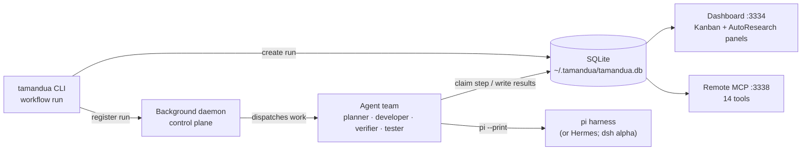

# Tamandua

<p align="center"></p>

<p align="center">
  <a href="LICENSE"></a>
  = 22">
  
  
  <a href="https://tamandua.tetradactyla.org/"></a>
</p>

Build your agent team in [pi](https://github.com/earendil-works/pi) with one command.

You don't need to hire a dev team. You need to define one. Tamandua gives you a team of specialized AI agents — planner, developer, verifier, tester, reviewer — that work together in reliable, repeatable workflows. One install. Zero infrastructure.

## Contents

- [Install from GitHub](#install-from-github)
- [Install from local checkout](#install-from-local-checkout)
- [Quickstart](#quickstart)
- [What You Get: Bundled Workflows](#what-you-get-bundled-workflows)
- [Why It Works](#why-it-works)
- [How It Works](#how-it-works)
  - [Test-Suite Ledger (TSTX)](#test-suite-ledger-tstx)
- [Build Your Own](#build-your-own)
- [Native AutoResearch](#native-autoresearch)
- [Security](#security)
- [Commands](#commands)
- [Requirements](#requirements)
- [License](#license) · [Origins](#origins)

### Install from GitHub

```bash
curl -fsSL https://raw.githubusercontent.com/igorhvr/tamandua/main/scripts/install.sh | bash
```

Or just tell your agent: **"Clone github.com/igorhvr/tamandua to my home dir, install it and learn the skill included inside it."**

### Install from local checkout

```bash
git clone https://github.com/igorhvr/tamandua.git
cd tamandua
./build-and-install
```

Or step by step:

```bash
./build        # npm install + tsc
./install      # symlink into ~/.local/bin
```

The `build` script handles everything: checks Node.js >= 22, runs `npm install`, compiles TypeScript. The `install` script creates a symlink at `~/.local/bin/tamandua` pointed at your checkout — so you can keep the source wherever you like and `tamandua` stays in sync. Both call into `scripts/install.sh` internally.

That's it. Run `tamandua workflow list` to see available workflows.

> **Not on npm.** Tamandua is installed from source (or GitHub), not the npm registry.

> **Requires Node.js >= 22.** If `tamandua` fails with a `node:sqlite` error, make sure you're running real Node.js 22+, not Bun's node wrapper.

---

## Quickstart

Sixty seconds from install to a running agent team:

```bash
$ tamandua workflow install feature-dev

# Or install all bundled workflows at once
$ tamandua workflow install --all
✓ Installed workflow: feature-dev

$ tamandua workflow run feature-dev "Add user authentication with OAuth"
Run: a1fdf573
Workflow: feature-dev
Status: running

$ tamandua workflow status "OAuth"
Run: a1fdf573
Workflow: feature-dev
Steps:
  [done   ] plan (planner)
  [done   ] setup (setup)
  [running] implement (developer)  Stories: 3/7 done
  [pending] verify (verifier)
  [pending] test (tester)
```

Then watch your team work in real time:

```bash
$ tamandua dashboard    # web UI at http://localhost:3334
```

<p align="center"></p>

---

## What You Get: Bundled Workflows

Tamandua ships with 23 bundled workflows organized into six families. Use `tamandua workflow list` to see available workflows, and `tamandua workflow install <id>` to install one.

### Worktree Variants

Worktree variants (`*-worktree`, `*-merge-worktree`) run in a detached git worktree
created from your origin repository. Your main working copy stays untouched until the
workflow completes. This gives you full isolation — continue working while agents
iterate — and a clean abort path: delete the worktree and nothing in your origin repo
has changed. The origin repository only sees changes when a `-merge` variant squashes
the result back into the original branch.

### Rugpull Handling

When a merge workflow (`-merge`, `-merge-worktree`) fails at the `finalize_merge`
step and the base branch tip has moved since the run started, Tamandua automatically
launches a fresh replacement run with the same parameters. This "rugpull" detection
runs after the final merge failure — if the base branch stayed put, no replacement is
triggered. Pass `--no-relaunch-upon-rugpull` to `workflow run` to suppress the
automatic replacement.

### When runs fail

Rugpull replacement runs are narrowly scoped: they only apply to
`finalize_merge` step failures in merge workflows (`*-merge`,
`*-merge-worktree`) where the base branch tip moved during the run.
All other failures — mid-pipeline step retry exhaustion, expects
validation exhaustion, worker death — permanently fail the run
UNLESS the workflow declares `on_fail.retry_step`, in which case
the run reroutes to the named upstream producer (bounded by
`max_reroutes`, default 2 before falling through to permanent
failure). Stale-tip (`FAILURE_CLASS: target_moved`) reroutes get
their own budget — `on_fail.max_target_moved_reroutes`, default 16 —
and do not consume `max_reroutes`, so concurrent landing contention
cannot terminally fail a merge run. No automatic replacement is
triggered for these failures.
Use `tamandua workflow resume <run-id>` to reattempt a permanently
failed run; fix the underlying issue before resuming.

#### Launch-time harness probe

Before a run's first real work round — and before any step is claimed —
the scheduler checks that the run's harness (pi, Hermes, or dsh,
whichever the run was launched with) can actually work. The probe asks
the harness to run the exact command `<launcher> skill-path` — the same
absolute CLI launcher path step prompts use, never a bare `tamandua`
that depends on the agent shell's `PATH` — and reply with the PATH. The
daemon computes the expected value itself by running the same command
in the same environment the harness receives, and the probe passes only
when the harness's final message contains that path as a whole line or
token (whitespace trimmed, markdown code fences/backticks stripped).
Anything else — wrong output, non-zero exit, signal death, or a wall
clock exceeded — fails the probe. The probe costs **one tiny model turn
per run** and runs exactly once per run: the outcome is persisted on the
run, so a daemon restart never re-probes a run that already passed.

On probe failure the run is force-failed immediately and legibly — no
workflow step is claimed or started — with a mechanical keyline block
(shown verbatim by `tamandua workflow status` and
`tamandua workflow run --wait`):

```
FAILURE_CLASS: harness_unavailable
HARNESS: pi
PROBE_CMD: /absolute/path/to/tamandua skill-path
EXPECTED: /absolute/path/to/skill
OBSERVED: <final harness message, at most 400 chars>
EXIT_CODE: 1
SIGNAL:
DURATION_MS: 320
STDERR_TAIL: <last 2000 chars of stderr>
```

The probe's wall clock defaults to **180 seconds**
(`TAMANDUA_HARNESS_PROBE_WALL_MS` overrides it). Set
`TAMANDUA_HARNESS_PROBE=0` to disable the probe entirely (escape hatch;
the probe is on by default).

A harness that passes the launch-time probe but breaks MID-run is handled
by the instant-fail relaunch policy (RSPN). A round is an instant fail
when the harness exits nonzero (or dies by signal) with zero output in
under 2 s without claiming a step. After **K** consecutive instant-fail
rounds (default **K = 6**) the scheduler starts an escalating relaunch
backoff instead of respawning on the fixed 15 s tick: relaunch delays
grow 30 s → 60 s → 120 s (capped). After **N** consecutive instant-fail
rounds (default **N = 20**) the run is force-failed with a precise reason
(`worker instant-fail loop: N consecutive sub-2s exit-1 rounds; last
command: …`) and a `run.instant_fail_loop` event. With the defaults the
horizon is about 27 minutes: six rounds on the 15 s tick, then 30 s /
60 s / 120 s backoffs up through the 20th round. Any non-instant-fail
round between failures resets the consecutive count.

### Feature Development

Story-based feature development. The planner decomposes your task into ordered user
stories. Each story goes through implement → verify → test before the next one starts.

<details>
<summary>Show the 5 Feature Development variants</summary>

| Variant | Workflow ID | Agents | Pipeline |
|---------|------------|--------|----------|
| Local-only | `feature-dev` | 5 | plan → setup → implement → verify → test |
| + Merge | `feature-dev-merge` | 7 | plan → setup → implement → verify → test → test_cmd_review → finalize_merge |
| Worktree | `feature-dev-worktree` | 5 | plan → setup → implement → verify → test |
| Worktree + Merge | `feature-dev-merge-worktree` | 7 | plan → setup → implement → verify → test → test_cmd_review → finalize_merge |
| GitHub PR | `feature-dev-github-pr` | 6 | plan → setup → implement → verify → test → pr → review |

</details>

**Local-only** stops after testing — commits stay on the feature branch, no merge or
PR. **+ Merge** variants add a `finalize_merge` step that squash-merges all commits
back into the original branch. **Worktree** variants run isolated in a detached worktree.
**GitHub PR** variants create a pull request and run a code review step.

### Bug Fix

Bug triage and fix. The triager reproduces the bug, the investigator finds the root
cause, the fixer patches it, and the verifier confirms the fix against acceptance
criteria.

<details>
<summary>Show the 5 Bug Fix variants</summary>

| Variant | Workflow ID | Agents | Pipeline |
|---------|------------|--------|----------|
| Local-only | `bug-fix` | 6 | triage → investigate → setup → fix → deception_audit → verify |
| + Merge | `bug-fix-merge` | 8 | triage → investigate → setup → fix → deception_audit → verify → test_cmd_review → finalize_merge |
| Worktree | `bug-fix-worktree` | 6 | triage → investigate → setup → fix → deception_audit → verify |
| Worktree + Merge | `bug-fix-merge-worktree` | 8 | triage → investigate → setup → fix → deception_audit → verify → test_cmd_review → finalize_merge |
| GitHub PR | `bug-fix-github-pr` | 7 | triage → investigate → setup → fix → deception_audit → verify → pr |

</details>

### Security Audit

Vulnerability scanning and patching. Scans for vulnerabilities, ranks by severity,
patches each one, re-audits after all fixes are applied, and runs regression tests.

<details>
<summary>Show the 5 Security Audit variants</summary>

| Variant | Workflow ID | Agents | Pipeline |
|---------|------------|--------|----------|
| Local-only | `security-audit` | 6 | scan → prioritize → setup → fix → verify → test |
| + Merge | `security-audit-merge` | 8 | scan → prioritize → setup → fix → verify → test → test_cmd_review → finalize_merge |
| Worktree | `security-audit-worktree` | 6 | scan → prioritize → setup → fix → verify → test |
| Worktree + Merge | `security-audit-merge-worktree` | 8 | scan → prioritize → setup → fix → verify → test → test_cmd_review → finalize_merge |
| GitHub PR | `security-audit-github-pr` | 7 | scan → prioritize → setup → fix → verify → test → pr |

</details>

### Quarantine Broken Tests

Detect failing tests, disable them minimally, and iterate until the full test suite
passes. Useful for establishing a clean baseline on a branch with known test failures.

<details>
<summary>Show the 3 Quarantine Broken Tests variants</summary>

| Variant | Workflow ID | Agents | Pipeline |
|---------|------------|--------|----------|
| Local-only | `quarantine-broken-tests` | 3 | setup → quarantine → verify |
| + Merge | `quarantine-broken-tests-merge` | 4 | setup → quarantine → verify → finalize_merge |
| Worktree + Merge | `quarantine-broken-tests-merge-worktree` | 4 | setup → quarantine → verify → finalize_merge |

</details>

### Quick Tasks

Single-agent workflows for quick one-off tasks and workflow auto-selection.

| Workflow ID | Agents | Pipeline | Description |
|------------|--------|----------|-------------|
| `do-now` | 1 | execute | Submit any task. Get back a success/failure report. No planning, no stories. |
| `just-do-it` | 1 | dispatch | Describe what you want. Dispatches to the most appropriate workflow automatically. For coding tasks (feature-dev*, bug-fix*, security-audit*) it defaults to merge-worktree variants unless the prompt gives a specific reason otherwise. |
| `do-review-do-verify` | 3 | do → review → do-again → verify | Two-pass execution: do the work, review it, revise, then verify the result. |

### Maintenance & Audits

Workflows for auditing and validating the project itself.

| Workflow ID | Agents | Pipeline | Description |
|------------|--------|----------|-------------|
| `frontend-test` | 1 | test | Builds the project and validates the dashboard frontend: HTML structure, route definitions, and test coverage. Does not start a second dashboard server. |
| `skills-normalize-audit` | 3 | scan → audit → report | Scans a skills directory, analyzes the skills for overlaps and redundancies, and produces consolidation recommendations in a structured report. |

Install all bundled workflows at once with:

```bash
$ tamandua workflow install --all
```

---

## Why It Works

- **Deterministic workflows** — Same workflow, same steps, same order. Not "hopefully the agent remembers to test."
- **Agents verify each other** — The developer doesn't mark their own homework. A separate verifier checks every story against acceptance criteria.
- **Fresh context, every step** — Each agent gets a clean session. No context window bloat. No hallucinated state from 50 messages ago.
- **Retry and reroute** — Failed steps retry automatically, and can be rerouted to upstream producers for fresh context. Stale-tip (`target_moved`) reroutes have their own budget (default 16) and do not consume `max_reroutes`. When budgets exhaust, the run fails — terminally and automatically. Nothing fails silently.
- **Zero tokens when idle** — Checking for work is a database peek, not a model call; agents spawn only when a step is ready, and completion nudges make step-to-step latency near zero. The old polling motor measured roughly 30% token overhead; the new motor: zero.

---

## How It Works

1. **Define** — Agents and steps in YAML. Each agent gets a persona, workspace, and strict acceptance criteria. No ambiguity about who does what.
2. **Install** — One command provisions everything: agent workspaces, scheduling, subagent permissions. No Docker, no queues, no external services.
3. **Run** — The scheduler checks for work deterministically (a DB peek — no model, no tokens) and spawns an agent only when a step is ready. Claim a step, do the work, pass context to the next agent. SQLite tracks state.



**Busy harness workdirs are refused by default.** The control plane admits at most one direct (non-worktree) run per harness working directory. When a second `workflow run` targets a directory that a live run already holds, it is **refused** with exit code 75 and an actionable message naming the holder (run number, workflow, status, since). The refusal text is:

```
Cannot start run: harness working directory {dir} is already held by run #{runNumber} ({workflowId}, status {status}, since {since}).
Retry later once the holder finishes, or:
  --queue-behind-holder  queue this run and admit it when the holder releases the directory
  --allow-multiple-runs-in-one-working-directory  run concurrently now; concurrent git writes in one checkout are your responsibility
  TAMANDUA_ALLOW_SHARED_HARNESS_WORKDIR=1  environment form of the allow flag
Worktree workflow variants (-worktree) never collide: each run gets its own worktree.
```

There are three ways out. Retry later once the holder finishes. Pass `--queue-behind-holder` to restore the previous waiting behavior: the run registers in the `waiting` state naming the holder, `workflow run` exits **0** with a queued-behind explanation, `tamandua status` shows `WAITING: waiting for harness workdir held by run <id>: <dir>`, and the daemon's reconciler admits the run automatically once the holder releases the directory. Or pass `--allow-multiple-runs-in-one-working-directory` (equivalently `TAMANDUA_ALLOW_SHARED_HARNESS_WORKDIR=1`) to run concurrently immediately, with one uniform warning. **Worktree-mode runs are untouched: `-worktree` variants never collide, because each run gets its own worktree.** Every other registration validation failure stays fatal.

The motor's invariants are pinned by an engineering contract with acceptance tests and real-model baselines: [tests/MOTOR-CONTRACT.md](tests/MOTOR-CONTRACT.md).

### Minimal by design

YAML + SQLite + deterministic dispatch. That's it. No Redis, no Kafka, no container orchestrator. Tamandua is a TypeScript CLI with zero external dependencies. It runs wherever pi runs. Checking for work never invokes a model — idle runs cost zero tokens.

### Test-Suite Ledger (TSTX)

Tamandua ships with a content-addressed test-suite ledger that skips redundant
test re-execution across workflow runs. When the same working tree with the
same test command has already passed, TSTX replays the recorded result instead
of re-running the suite.

**How it works:**
- `tamandua-test` wraps every test command (via `{{test_cmd}}`) and computes a
  content-hash of the working tree using `git write-tree` on a temporary index —
  the repository's real index is never touched
- On a cache hit (same tree + same command, green within 24h), the result is
  replayed with exit 0 — no re-execution needed; a `TAMANDUA-TEST CACHED`
  banner identifies the replay
- On a cache miss or any doubt, the command runs normally — the shim passes
  through stdout/stderr and exit code unchanged
- TSTX hashes the tree again after the command exits and records a result only
  when the pre/post hashes match. If tracked or untracked-not-ignored content
  changes (or the post-run hash is unavailable), the result is not cached and
  a stable-tree rerun is required. A passing command fails closed with shim
  exit code 86; an already-failing command keeps its original nonzero code.
  The abandoned single-flight claim is released so a waiter can rerun promptly.

**Safety:** TSTX is **strictly monotone** — it may only skip work that is
provably redundant (a green result for the byte-identical tree and command).
On any doubt, error, or unexpected condition, it degrades to running the real
command unchanged (passthrough). It is impossible for TSTX to make a task
slower, wrong, or uncompletable compared to not having TSTX at all. Passthrough
is byte-identical to the raw command except for a single stderr notice.

**Kill switch:** Set `TAMANDUA_TSTX=0` to disable TSTX entirely — all test
commands bypass the ledger and execute directly.

**Submodule caveat:** `git write-tree` records submodule pointers (commits),
not their dirty working tree contents. If your repository uses submodules,
changes inside a submodule won't be reflected in the tree hash until they're
committed and the pointer is updated in the parent repository.

---

## Build Your Own

The bundled workflows are starting points. Define your own agents, steps, retry logic, and verification gates in plain YAML and Markdown. If you can write a prompt, you can build a workflow.

```yaml
id: my-workflow
name: My Custom Workflow
agents:
  - id: researcher
    name: Researcher
    workspace:
      files:
        AGENTS.md: agents/researcher/AGENTS.md

steps:
  - id: research
    agent: researcher
    input: |
      Research {{task}} and report findings.
      Reply with STATUS: done and FINDINGS: ...
    expects: "STATUS: done"
```

Full guide: [docs/creating-workflows.md](docs/creating-workflows.md)

---

## Native AutoResearch

Tamandua includes native AutoResearch primitives for measurable optimization loops.
Unlike a normal workflow, AutoResearch stores durable project-local state so an
agent can resume after restarts, learn from each measured run, and choose the next
experiment from evidence.

Use AutoResearch when the task has a reliable numeric metric and the agent should
run a sequence of experiments instead of one batch of edits. Typical examples are
raising test coverage, reducing validation loss, improving latency, or lowering
cost while preserving correctness.

```bash
tamandua autoresearch init \
  --goal "reduce validation loss" \
  --metric val_bpb \
  --direction lower \
  --command "uv run train.py"

tamandua autoresearch run-experiment
tamandua autoresearch log-experiment --status auto \
  --description "try lower learning rate" \
  --hypothesis "smaller LR improves stability" \
  --learned "validation improved but training slowed" \
  --next-focus "test warmup schedule"
tamandua autoresearch next

# Inspect the loop for a Tamandua workflow run
tamandua workflow autoresearch <run-id>
```

### Triggering AutoResearch

AutoResearch can be driven manually from any project directory, or delegated to a
Tamandua workflow agent. In both cases the project needs a metric command that
prints one parseable number. The command should be deterministic enough to compare
experiments and should exclude generated or third-party code when measuring a
project-owned objective.

Manual loop:

```bash
cd /path/to/project

tamandua autoresearch init \
  --goal "Increase unit test coverage to 1.000 without changing application code" \
  --metric coverage \
  --unit ratio \
  --direction higher \
  --command "./measure-test-coverage.sh" \
  --metric-regex "^([0-9]\\.[0-9]{3})$" \
  --checks-command "./measure-test-coverage.sh"

tamandua autoresearch run-experiment
tamandua autoresearch log-experiment --status auto \
  --description "baseline coverage" \
  --hypothesis "establish current coverage" \
  --learned "baseline recorded" \
  --next-focus "cover the lowest-risk uncovered module"
tamandua autoresearch next
```

Workflow-driven loop:

```bash
tamandua workflow install do-now
tamandua dashboard start

tamandua workflow run do-now \
  "In the target repo, create or verify ./measure-test-coverage.sh, initialize tamandua autoresearch, then run 10 bounded experiments. Before each edit run tamandua autoresearch next. Only add or change tests/fixtures/test config. After each experiment run tamandua autoresearch run-experiment and tamandua autoresearch log-experiment --status auto with description, hypothesis, learned, and next-focus. Stop and report best metric, commits, and remaining gaps." \
  --working-directory-for-harness /path/that/contains/or/is/the/project \
  --pi-as-harness
```

Monitor it while the workflow runs:

```bash
tamandua workflow status <run-id>
tamandua workflow autoresearch <run-id>
open http://localhost:3334
```

The dashboard's AutoResearch panel reads the run's harness working directory,
discovers the nearest `autoresearch.config.json` / `autoresearch.jsonl`, and
renders the experiment trace. Gray points are attempted experiments; green points
and the green line are the kept best-so-far frontier.

### Session Registry

Tamandua maintains a SQLite registry of AutoResearch sessions so the dashboard
can discover them directly without scanning workflow runs. The registry lives in
a table called `autoresearch_sessions` inside the main Tamandua database
(`~/.tamandua/tamandua.db`).

- **Project-local files are the source of truth.** `autoresearch.config.json`,
  `autoresearch.jsonl`, `autoresearch.md`, and `autoresearch.sh` remain on disk
  in your project. The DB registry is an index/cache for discovery and dashboard
  UX — it never modifies your project files.
- **Sessions are registered automatically.** Every `tamandua autoresearch` command
  (init, run-experiment, log-experiment, status, next, loop) updates or creates
  the registry entry for that project directory.
- **Backfill on dashboard start.** When the dashboard starts, it scans recent
  workflow runs for harness directories that contain AutoResearch files and
  backfills any missing registry entries.

### Pruning Stale Registry Entries

Use `tamandua autoresearch prune` to clean up stale registry rows without
removing any project-local files.

```bash
# Prune sessions not updated in 30 days
tamandua autoresearch prune --older-than 30d

# Prune only sessions whose project files no longer exist
tamandua autoresearch prune --older-than 7d --missing

# Preview what would be pruned without deleting
tamandua autoresearch prune --older-than 30d --dry-run
```

The prune command only touches the SQLite registry — your `autoresearch.jsonl`,
config files, and experiment history remain untouched on disk.

### Example Experiment

For a test-coverage loop, a single experiment should be narrow enough to explain
before editing and measurable enough to keep or discard after the run.

```bash
# 1. Ask the ratchet what evidence should drive the next edit.
tamandua autoresearch next

# Example returned focus:
# Best run 1: 0.336 ratio
# Next focus: cover pure helpers in batch_processor without touching application code

# 2. Make one focused test-only change.
# Example hypothesis:
# "Adding unit tests for batch_processor pure helper functions will increase
# coverage without requiring Spark or changing runtime code."

# 3. Measure and log the result.
tamandua autoresearch run-experiment
tamandua autoresearch log-experiment --status auto \
  --description "cover batch_processor pure helpers" \
  --hypothesis "pure-helper tests increase coverage without Spark" \
  --learned "coverage increased from 0.336 to 0.477; helper paths are now covered" \
  --next-focus "cover utils.py pure helpers and runtime stubs"
```

If the metric improves in the configured direction and checks pass, the logged run
is kept. If it regresses, crashes, or fails checks, it is logged as discarded,
crash, or checks_failed; with `--revert-discard`, Tamandua can revert non-state
experiment files while preserving `autoresearch.jsonl`.

Project files:

| File | Purpose |
|------|---------|
| `autoresearch.config.json` | Session config: goal, metric, direction, command, parser, checks. |
| `autoresearch.md` | Agent-facing objective and operating loop. |
| `autoresearch.jsonl` | Append-only run history: measured results, decisions, learning, next focus. |
| `autoresearch.sh` | Benchmark command. |
| `autoresearch.checks.sh` | Optional correctness checks run after successful measurements. |

When a workflow run was started with `--working-directory-for-harness`, the
dashboard includes an AutoResearch panel that reads that directory's
`autoresearch.jsonl` and shows best/baseline metrics, kept/discarded counts,
failures, and the recent learning timeline.

The core loop is `init -> run-experiment -> log-experiment -> next`. `log --status auto` classifies a
run as `baseline`, `keep`, `discard`, `crash`, `metric_not_found`, or `checks_failed` by comparing the
latest metric with prior accepted results (`metric_not_found` when the command exits 0 but the metric cannot be parsed from its output — such runs do not update best/baseline). The `next` prompt carries the ratchet:
it restates the goal, best result, last learning, and next focus before the agent
starts another experiment.

---

## Security

You're installing agent teams that run code on your machine. We take that seriously.

- **Curated repo only** — Tamandua only installs workflows from the official repository. No arbitrary remote sources.
- **Reviewed for prompt injection** — Every workflow is reviewed for prompt injection attacks and malicious agent files before merging.
- **Community contributions welcome** — Want to add a workflow? Submit a PR. All submissions go through careful security review before they ship.
- **Transparent by default** — Every workflow is plain YAML and Markdown. You can read exactly what each agent will do before you install it.

### Automatic per-execution signal isolation

Every harness execution — each work round of pi, Hermes or dsh, **and** the
launch-time harness probe — runs in its own fresh native signal-security
domain, so a worker can signal its own execution's processes but not another
execution, the scheduling daemon, or unrelated host processes. This is
automatic, per execution, with no user-facing knobs:

- **Linux:** Landlock `SIGNAL` scope (kernel ABI ≥ 6). The helper is built
  locally during `npm run build` (working C compiler plus a
  `linux/landlock.h` header defining `LANDLOCK_SCOPE_SIGNAL` at build
  time); a kernel ABI alone does not supply the helper.
- **macOS:** the system `sandbox-exec` command with a small Seatbelt
  profile — opportunistic, since Apple has deprecated `sandbox-exec`.
- **Fallback:** if the native backend is unavailable or setup fails before
  any harness work starts, Tamandua warns prominently, durably records
  `mode=unprotected-fallback` with the reason, run identity and UTC time,
  and runs the harness normally. Tamandua never becomes unusable on older
  or restricted systems.

This is process-signal isolation, not a filesystem sandbox, and it is
best-effort rather than a complete security boundary. See
[docs/native-signal-isolation.md](docs/native-signal-isolation.md) for the
full description, the honest Linux privilege/mount caveats, the macOS
policy and deprecation status, and the stated limits.

---

## Troubleshooting

If something isn't working as expected, start with the built-in diagnostic:

- **Run `tamandua doctor`** — One-shot diagnostic that checks environment (Node.js >= 22, pi on PATH, gh on PATH), services (dashboard, daemon, MCP), daemon staleness (running daemon matches installed build), database state (run-level anomalies), and LLM prompt adherence (per-step key-emission rates from workflow runs, measuring how often agents deliver expected output keys). Each check prints **pass/fail** status and on failure prints the **exact remedy command** to run.
- **Check service status** — Run `tamandua status` to verify dashboard, daemon, and MCP are running on their expected ports.
- **Check logs** — Run `tamandua logs` to see recent daemon events. For live tailing: `tamandua logs-tail`.
- **Restart services** — If the daemon (control plane + motor) is unresponsive, run `tamandua daemon restart`. The dashboard UI can be restarted independently with `tamandua dashboard restart` (safe — never touches the motor). To pick up a locally rebuilt tree, run `./build-and-install` followed by `tamandua restart` — this restarts all services with a real stop→ready barrier instead of blind sleeps.

---

## Commands

### Lifecycle

| Command | Description |
|---------|-------------|
| `tamandua get-ready` | Install bundled workflows and start dashboard/control plane |
| `tamandua source-path` | Print the Tamandua source checkout path |
| `tamandua skill-path` | Print the path to the bundled tamandua-agents agent skill |
| `tamandua update [--force]` | Pull the source checkout, rebuild, reinstall workflows (refreshes all installed bundled workflow files — local edits are overwritten), and restart previously running services. For local development, use `./build-and-install && tamandua restart` instead. |
| `tamandua uninstall [--force]` | Full teardown (agents, crons, DB) |

### Workflows

| Command | Description |
|---------|-------------|
| `tamandua workflow run <id> <task> [--working-directory-for-harness <dir>] [--wait [--timeout <dur>] [--json]] [--pi-as-harness \| --hermes-as-harness \| --dsh-as-harness]` | Start a run (defaults harness CWD to your current directory). With `--wait`, block until the run finishes |
| `tamandua workflow status <query>` | Check run status |
| `tamandua workflow runs` | List all runs |
| `tamandua workflow wait <selector...> [--all] [--timeout <dur>] [--json] [--quiet]` | Block until selected runs reach terminal status |
| `tamandua workflow resume <run-id>` | Resume a paused, failed, or drain-pending run (re-queues failed loop stories; a plain resume cancels a pending `pause --drain`) |
| `tamandua workflow stop <run-id>` | Stop/cancel a running workflow |
| `tamandua workflow cancel <run-id>` | Alias for stop — cancels a running workflow |
| `tamandua workflow delete <run-id> [--force]` | Permanently delete a workflow run and associated data |
| `tamandua workflow list [--id <name>] [--json]` | List available workflows. `--id <name>` prints a single workflow's entry and exits 1 when it is missing |
| `tamandua workflow install <id> [--all]` | Install one or all workflows. **Installed bundled definitions are refreshed on every install/update** — local edits are overwritten. To customize a workflow, copy it under a new workflow id. |
| `tamandua workflow uninstall <id>` | Remove a single workflow |

### Atomic landing

| Command | Description |
|---------|-------------|
| `tamandua merge-branch --origin <repo> --branch <branch> --into <target> --expect-tip <sha> --message <message>` | Atomically land a plumbing-based squash merge with managed checkout parking. A clean attached target is refreshed in place (`refreshed`); a dirty attached target remains safely on a backup branch (`parked:<branch>`); a coherent owned no-op reports `already-coherent`; a stale owned no-op reports `checkout-not-at-tip`; and a bare or unowned target reports `no-checkout-to-refresh`. Every landing also reports the verified `TARGET_TIP_BEFORE` and live-reread `TARGET_TIP_AFTER`. Multiple owners, invalid or ambiguous ownership metadata, and an owner operation in progress remain bounded refusals. See [Atomic merge-branch landing](docs/merge-branch.md). |

### Management

| Command | Description |
|---------|-------------|
| `tamandua restart [--force]` | Restart all services (daemon, dashboard, MCP) with stop→ready barrier — no sleep guessing. The sanctioned way to pick up a locally rebuilt tree (`./build-and-install` first, then `tamandua restart`). |
| `tamandua dashboard start\|stop\|restart\|status [--port N]` | Manage the standalone dashboard UI server (safe anytime) |
| `tamandua daemon start\|stop\|restart\|status` | Manage the daemon (control plane + scheduling motor) |
| `tamandua mcp start\|stop\|restart\|status [--port N]` | Manage the standalone MCP server |
| `tamandua control-plane start\|stop\|restart\|status [--port N]` | Alias for daemon commands (control plane is hosted by daemon) |
| `tamandua logs [<lines>\|<run-id>\|#<run-number>] [--tail <N>] [--follow \| -f]` | View recent log entries and exit (bounded). `--tail N` shows the last N entries; `--follow`/`-f` instead blocks and follows like `logs-tail`. |
| `tamandua logs-tail [<lines>\|<run-id>\|#<run-number>]` | Follow recent activity as new events arrive — blocks until Ctrl-C or until the followed run ends |
| `tamandua nudge` | Trigger an immediate dispatch round for all running runs |

When you start the management dashboard (`tamandua dashboard`), Tamandua automatically starts the remote MCP server too.

- Dashboard: `http://localhost:3334` (or your custom `--port`)
- MCP endpoint: `http://localhost:3338/mcp` (fixed port)

Use `tamandua dashboard status` to verify both endpoints are up.

The standalone dashboard (and `tamandua get-ready`, which starts it) listens
on port **3334 by default**, but honors the `TAMANDUA_DASHBOARD_PORT`
environment variable — a valid 1–65535 value overrides the default, and an
unset/empty/invalid value falls back to 3334 (same resolution as
`tamandua dashboard --port N`).

By default, the dashboard and MCP servers bind to `127.0.0.1` (localhost only), so they are not reachable from other machines on the network. If you need remote access, set `TAMANDUA_BIND_HOST=0.0.0.0` (or a specific IP) before starting the dashboard:

```bash
TAMANDUA_BIND_HOST=0.0.0.0 tamandua dashboard --port 3334
```

This environment variable applies to both the dashboard HTTP server and the MCP HTTP server. The control plane already binds independently to `127.0.0.1` and is not affected by this setting.

#### Kanban view

Each run also has a swim-lane view at `http://localhost:3334/runs/<run-id>/kanban`
(linked from the run-ID in the dashboard's runs table). Lanes are derived
dynamically from the workflow's steps: single steps render one card per lane,
loop steps (e.g. the developer agent iterating over user stories) render one
card per story. Cards are colour-coded by status (todo / running / done /
failed) and the page polls `/api/runs/<run-id>/kanban` every 3 seconds. The
JSON endpoint is also useful for external integrations — see
`src/server/kanban-data.ts` for the response shape.

<p align="center"></p>

### Diagnostics & evidence

| Command | Description |
|---------|-------------|
| `tamandua run diagnose <run-id\|run-number> [--out <dir>] [--json]` | Assemble a read-only diagnostics bundle for one run (default `<state>/diagnostics/<run-id>-<ts>`; `--out` writes `<dir>/<run-id>`). Prints the summary and the bundle path. |
| `tamandua evidence prune --older-than <days> [--yes] [--json]` | Remove old run evidence artifacts for terminal runs. Manual only and a dry run by default; `--yes` executes. |

#### Diagnostics bundle

`tamandua run diagnose` is READ-ONLY: it never starts or contacts the daemon, and
works whether the daemon is running or stopped. It writes one directory per run
containing:

- (a) the run, step, story, story-abandonment and worktree rows as JSON;
- (b) the run's complete event stream across rotations, in order;
- (c) daemon-log lines mentioning the run id or its short id (current and rotated logs);
- (d) the harness session-store PATHS for each round (pi/dsh/hermes — paths only, never credentials or session contents);
- (e) the run's evidence directory listing (paths and sizes) and its suite-ledger rows including `log_path`;
- (f) for Matchlock-backed rounds: VM ids, their console/serial logs when present, invocation error records and the stored mount-plan/policy JSON (secret-bearing fields redacted);
- (g) a `summary.json` and `SUMMARY.md` with run status, the step/story timeline, retries, the force-fail reason and the last stderr lines of the last failing round.

A missing source is reported as `absent` inside the bundle, never as an error.
Attach the whole bundle directory to a bug report.

#### Evidence prune

`tamandua evidence prune --older-than <days>` is MANUAL ONLY — nothing schedules
it — and a DRY RUN by default: without `--yes` it only lists what it would remove,
with sizes and totals. It covers per-run evidence directories, per-run diagnostics
bundles, suite-logs files and already-removed run worktrees for runs whose terminal
instant is older than the threshold. Runs that are running, paused or pending, and
artifacts that cannot be mapped to a known run, are refused/kept. It never touches
run/step/story rows, the suite ledger, the event stream or the daemon log.

### Harness Selection

By default, Tamandua uses **pi** (`pi --print`) as its agent harness. You can
override this with the harness selection flags on `tamandua workflow run`:

| Flag | Description |
|------|-------------|
| `--pi-as-harness` | Use pi as the agent harness. **This is the default.** |
| `--hermes-as-harness` | Use [Hermes](https://github.com/NousResearch/hermes-agent) as the agent harness instead of pi. |
| `--dsh-as-harness` | Use [DeepSeek Harness (`dsh`)](https://github.com/deepseek-ai/deepseek-harness) as the agent harness instead of pi. **Alpha quality** — see below. |

These flags are **mutually exclusive** — specifying both is an error.

#### Hermes Support

Hermes is a fully supported alternative harness. Token usage is read from
Hermes' `state.db` after each round and falls back to 0 tokens with a warning
if the Hermes schema is unavailable or changed.

##### Hermes Binary Resolution

Tamandua resolves the Hermes binary through a **three-tier chain**. The
resolver never creates, deletes, replaces, chmods, or otherwise mutates any
user executable or symlink — discovery is entirely side-effect-free.

**Tier 1 — Explicit environment variable (always wins):**

```bash
export TAMANDUA_HERMES_BINARY=/path/to/hermes
```

Set `TAMANDUA_HERMES_BINARY` to an absolute or relative path. Relative paths
are resolved against the daemon's working directory at scheduling time. If the
path is not executable, the run fails immediately with a clear actionable
error.

**Tier 2 — Current process PATH:**

If `TAMANDUA_HERMES_BINARY` is not set, Tamandua searches the daemon's own
`PATH` for `hermes`. When `noHurrySaveTokensMode` is enabled, Tier 2 first
searches for `hermes-token-saver` (a token-saving wrapper) before falling back
to a bare `hermes` binary.

**Tier 3 — Login-shell fallback (bounded):**

If neither the env var nor the process `PATH` yields a working Hermes,
Tamandua spawns `zsh -lic 'command -v hermes'` so Hermes installed via
nix/homebrew/npm in shell-specific paths is discoverable even when not on the
daemon's `PATH`. The returned path is `realpath`-resolved and validated with
`X_OK`. This fallback is bounded and only runs when the first two tiers fail.

##### Absolute-Path Invocation

Every resolved binary path is **guaranteed to be absolute**. Relative
`TAMANDUA_HERMES_BINARY` values and relative/empty `PATH` entries are resolved
against the daemon process's current working directory at validation time. This
prevents `./hermes: not found` errors when the dispatcher invokes the binary
from a different working directory.

##### Child-Only PATH Adjustment

When dispatching a Hermes agent session, the resolved binary's directory is
prepended to the child's `PATH` so nested Hermes invocations within the agent
session find the same binary, even when the daemon's own `PATH` lacked it
(e.g. login-shell-discovered Hermes). The original `PATH` is preserved as a
suffix so standard system tools remain reachable.

##### Zero Filesystem Mutation

Tamandua's Hermes discovery is **entirely side-effect-free**: it never
creates, deletes, replaces, chmods, or otherwise mutates `~/.local/bin/hermes`
or any other user executable or symlink. The old behavior of automatically
managing a `~/.local/bin/hermes` symlink has been removed.

The harness validation runs at scheduling time — if no Hermes binary is found
through any tier, the run fails immediately with a clear error.

##### Hermes E2E Canary

`./run-hermes-e2e-canary` is an **opt-in** end-to-end canary that validates
the full Hermes pipeline against the real Hermes binary. It launches a single
trivial workflow run (`--hermes-as-harness`) through the daemon, scheduler, and
Hermes harness, then audits the token-attribution chain:
`session_id` trailer → `state.db` lookup → `runs.tokens_spent` > 0.

> **⚠️ Spends real tokens and can take 30+ minutes.** The canary is
> never part of `./run-all-e2e-tests` or `npm test`. Run it manually after
> Hermes upgrades or when changing the harness adapter.

```bash
./run-hermes-e2e-canary
```

The test **silently skips** with a clear message when no Hermes binary is
found on `PATH` or via `TAMANDUA_HERMES_BINARY`. A temporary isolated Tamandua
home is created for each run, but `~/.hermes` is symlinked in so the real
Hermes binary can find its credentials and config.

##### Matchlock Execution (`--matchlock`) and the Synthetic Whole-Path Gates

`--matchlock <image>` executes every dispatched harness invocation (launch
probe and work round) inside a **fresh Matchlock VM** instead of on the host.
The image must already provide the selected harness (`pi`, `hermes` with
`--hermes-as-harness`, or `dsh` with `--dsh-as-harness`) and its runtime;
Tamandua mounts its version-matched RO guest helper pack at
`/workspace/runtime` (guest reporting CLI at
`/workspace/runtime/bin/tamandua`) and never installs a harness or falls back
to host/native execution. Passing the flag is the **only** opt-in — no env
var, workflow YAML, agent output, or MCP/API default activates Matchlock;
without it the run uses the native path and performs zero Matchlock actions.

**Launch-time probe cost (accepted by design).** Every opted-in run performs
ONE launch-time harness probe before the first work round: **one real model
round** in a fresh Matchlock VM, proving the image's guest harness can answer
the `<launcher> skill-path` contract before real work starts. Measured probe
cost is approximately `pi` ~1.7k, `dsh` ~6.8k and `hermes` ~9.2k tokens per
probe, plus one VM boot; the probe tokens are attributed to the run. This cost
is accepted by design (once per run, not per round) and is distinct from the
zero-provider synthetic gates below, which spend no model tokens.

Supported harnesses and workflows in this build:

- `--pi-as-harness` (default), `--hermes-as-harness` and `--dsh-as-harness`
  may all be combined with `--matchlock`, and all three are admitted for the
  same workflow set: there is **no harness-by-workflow allow-list**.
- Admission preflights each workflow's known later-role capabilities (guest
  git, the packed `tamandua-test` suite evidence, the scoped `merge-branch` op
  and the bounded run queries) and refuses a workflow whose explicit closure is
  not provided before any VM/probe/native harness starts.
- The admitted capability-closed set is `do-now` / `do-review-do-verify` (no
  later-role tools); the non-merge story/worktree pipelines `feature-dev`,
  `feature-dev-worktree`, `bug-fix`, `bug-fix-worktree`,
  `quarantine-broken-tests`, `security-audit` and `security-audit-worktree`
  (guest git + packed suite + bounded run queries); and every merge route
  `feature-dev-merge`, `feature-dev-merge-worktree`, `bug-fix-merge`,
  `bug-fix-merge-worktree`, `quarantine-broken-tests-merge`,
  `quarantine-broken-tests-merge-worktree`, `security-audit-merge` and
  `security-audit-merge-worktree` (the same closure plus `merge-branch`).
- Shapes outside that closure are **refused before any VM/probe/native harness
  starts** with a workflow-specific precise reason (`matchlock_workflow_unsupported`):
  `*-github-pr` needs a guest `gh` CLI plus provisioned remote auth,
  `just-do-it` needs bounded child workflow dispatch, `frontend-test` needs
  browser/visual verification and `skills-normalize-audit` scans an
  operator-specified directory outside the admitted original root; an
  unknown/custom workflow id fails closed. These are *not* completed overall
  workflow support; do not rely on `--matchlock` for workflows this build does
  not support. `--matchlock` is refused with no image. See
  `tamandua workflow run --help`.

The exact harness × workflow matrix in this build is:

| Harness | Accepted under `--matchlock` | Refused (before any VM/probe/native harness) |
|---------|------------------------------|---------------------------------------------|
| `pi` (default / `--pi-as-harness`) | the full capability-closed set listed below | the precise refusals listed below |
| `hermes` (`--hermes-as-harness`) | the same admitted set (no harness-by-workflow allow-list) | the same precise refusals |
| `dsh` (`--dsh-as-harness`) | the same admitted set (no harness-by-workflow allow-list) | the same precise refusals |

Admitted for all three harnesses:
`do-now`, `do-review-do-verify`, `feature-dev`, `feature-dev-worktree`,
`bug-fix`, `bug-fix-worktree`, `quarantine-broken-tests`, `security-audit`,
`security-audit-worktree`, `feature-dev-merge`, `feature-dev-merge-worktree`,
`bug-fix-merge`, `bug-fix-merge-worktree`, `quarantine-broken-tests-merge`,
`quarantine-broken-tests-merge-worktree`, `security-audit-merge` and
`security-audit-merge-worktree`.

Refused for all three harnesses with a precise reason:
`*-github-pr` needs a guest `gh` CLI plus provisioned remote auth;
`just-do-it` needs bounded child workflow dispatch; `frontend-test` needs
browser/visual verification; `skills-normalize-audit` scans an
operator-specified directory outside the admitted original root; an
unknown/custom workflow id fails closed.

###### Matchlock VM resources (`--matchlock-cpus` / `--matchlock-memory` / `--matchlock-disk`)

Every Matchlock VM boots with an explicit resource policy. Three flags size it
for an opted-in run: `--matchlock-cpus <n>` (a positive integer),
`--matchlock-memory <MB|16g>` and `--matchlock-disk <MB|40g>` (a positive
integer number of MB, or a `<n>g` suffix meaning `n*1024` MB). Any of the three
requires `--matchlock <image>`. When a flag is absent the operator env var
`TAMANDUA_MATCHLOCK_CPUS`, `TAMANDUA_MATCHLOCK_MEMORY_MB` or
`TAMANDUA_MATCHLOCK_DISK_MB` supplies the value; when neither is set the
built-in default applies: `cpus = min(8, host CPUs)`,
`memory = min(16384 MB, 50% of host RAM)`, `disk = 20480 MB`. Explicit flags and
env values are **always clamped by the standing caps**: `cpus <= 16` ALWAYS (a
project rule) and `cpus <= host online CPUs`, `memory <= 75% of host MemTotal`,
and `disk` must be finite positive. Precedence per field is flag > env >
built-in default. The launch output prints the resolved limits
(`matchlock: <image> cpus=<n> memory=<MB>MB disk=<MB>MB`), the limits are
recorded in the run's Matchlock policy, and `tamandua workflow status <run>`
shows them for a Matchlock run.

###### Pi under Matchlock

`--pi-as-harness` (the default) runs the image's pi inside fresh VMs; the pi
invocation runner and its no-flag behavior are unchanged from earlier
milestones. The runner builds first, resolves the runtime from PATH (the
system `matchlock` CLI; `TAMANDUA_MATCHLOCK_RPC_BIN` / `MATCHLOCK_GUEST_INIT` /
`MATCHLOCK_GUEST_FUSED` are optional overrides) and records the observed
version/hashes as evidence — there are no runtime sha256 pins. It allocates a
NEW unique evidence directory with mkdtemp
(`/root/matchlock-work/evidence/pi-exec-<random>/`,
outside the repo, never pre-cleaned, never reused) plus a private fresh
`TMPDIR`, and drives both supported workflows to real completion through an
isolated daemon → scheduler → fresh-VM path, then records an exact owned-VM
cleanup ledger and propagates cleanup failures. The gate also asserts
per-invocation FRESH-VM receipts (no reuse), strict suite-row binding to the
exact run, the intended synthetic usage totals, and treats corrupt
event/inventory JSON as an error. The synthetic fixture declares a NON-default
image `ENV PATH` and installs its test `pi` only there, so the whole path
proves the host runner preserves the USER IMAGE's effective PATH (helper-pack
prepend only, no host default).

###### Pi managed-worktree and merge workflows

For the `pi` harness the worktree/merge routes also run in fresh VMs:
`feature-dev-merge-worktree`, `bug-fix-merge-worktree` and the direct
`feature-dev-merge` / `bug-fix-merge` routes. The merger role lands through
the scoped guest `merge-branch` op (a typed host authorization check runs
BEFORE any Git; the host independently verifies the authoritative target tip
and emits the run-attributed landing), the tester's packed `tamandua-test`
records real host-owned suite rows for the finalizer ledger seam, and the
scheduler builds the host merge context from immutable run scope. The
on-demand worktree/merge gate below drives a real target_moved → rebase →
retest loop on a tiny owned origin. The `hermes` and `dsh` harnesses carry the
same admitted workflow set: there is no harness-by-workflow allow-list, and
every admitted workflow (including the merge shapes) is executable by each
harness.

###### Hermes under Matchlock (synthetic-fixture qualification)

The Hermes opt-in recipe is:

```bash
tamandua workflow run <workflow-id> "<task>" --hermes-as-harness --matchlock <image>
```

The image must already provide a Linux Hermes executable and its runtime.
Tamandua never installs Hermes on the host, never consults the host
`TAMANDUA_HERMES_BINARY`/`PATH` resolution for an opted-in run, and never
falls back to native/Hermes-on-host execution. Each launch probe **and** each
work round runs in its own **fresh Matchlock VM** with the versioned guest
helper pack mounted read-only; the invocation's broker/registry authority is
revoked on cancel, EOF, timeout, or protocol refusal (even when idle), and the
owned VM is positively closed when the round ends. A genuine product failure
is not masked by reusing a VM or by swallowing a teardown error.

**Configuration selection and mount.** The effective Hermes configuration is
resolved from the **submission** environment (`HOME` / `HERMES_HOME` / cwd
captured at run creation), never the daemon's later ambient state, and is
frozen into the persisted policy so retry/resume can never re-pin a moved tag
or re-read `HERMES_HOME`. The whole canonicalized effective configuration
directory is mounted **read-write** at the native guest override location, and
the guest `HERMES_HOME` is set to that exact mount:

| Effective selection | Host source (mounted whole, RW) | Guest `HERMES_HOME` |
|---------------------|---------------------------------|---------------------|
| default | `$HERMES_HOME` (or `~/.hermes`) | `/workspace/config/hermes` |
| named profile | `<root>/profiles/<name>` | `/workspace/config/hermes/profiles/<name>` |

These are the **disclosed writable roots**: the entire selected configuration
directory — including credentials, settings, `state.db`, sessions, logs and
plugins — is read-write inside the VM, matching the accepted damage model for
the mounted worktree and original repository. Broad host `HOME` or `.tamandua`
administrative state is **never** exported, and a lexical prefix check alone is
not accepted as confinement. A missing, malformed, unreadable, non-regular, or
explicitly non-local (non-`local` terminal backend) configuration is refused
**before** any VM create with bounded diagnostics; a genuine configuration root
whose config file is empty/comment-only uses Hermes' built-in default.

**Output, session, and token semantics.** Guest Hermes produces **plain-text**
output (not pi JSON); the round's final assistant message is the plain-text
stdout and is preserved separately from the raw stdout/stderr artifacts. The
authoritative session id is the `session_id:` **stderr trailer**; the usage
projection reads the selected mapped store **inside the still-owned VM** before
the VM is confirmed closed and totals only `input + output + cache_write`
(cache reads are excluded). Missing, unknown, ambiguous, or truncated token
data is reported `unavailable` and is **never** fabricated as `0`.

**Actual vs synthetic.** This build's Hermes-under-Matchlock qualification is
**synthetic-fixture qualification**, not real-Hermes acceptance:

| Layer | Status in this build |
|-------|----------------------|
| Hermes adapter / runner / policy / scheduler / CLI wiring | Implemented; deterministic and seam tests pass |
| Fresh-VM whole-path gate (`do-now`, `do-review-do-verify`) | Synthetic fixture only — image-provided fake Hermes, **zero models**, no credentials/network |
| Real Hermes model `deepseek-v4-flash-vision-exp` (DeepSeek provider, no Codex/MoA) with real credentials | **Not qualified here** — coordinator-owned remaining work |

###### dsh under Matchlock (synthetic-fixture qualification, MTLK-DSH-EXEC)

`--dsh-as-harness --matchlock <image>` (MTLK-DSH-EXEC) resolves the effective
`DSH_HOME` once at **submission** time (default `<captured home>/.dsh`, or an
explicit `DSH_HOME` with relative/tilde semantics captured from the submitting
process — never rediscovered from the daemon HOME/env), pins the image
content+config identity, and mounts the **whole frozen effective home
directory read-write at the guest `/workspace/config/dsh` as one mount**
(preserving `sessions/`, `profiles/`, `storages/`, credentials and unknown
entries — never a copied or selective disposable subset). Each round runs the
image's `dsh --profile headless <prompt>` with stdin EOF, plain-text stdout
preserved and `DSH_PERMISSION_MODE` applied inside the isolation; the image's
effective `PATH` is preserved with only the helper-pack bin prepended.
Retry/resume reuse the persisted pin and never re-pin a moved tag. Usage is
attributed from the mounted v2 session store with an integer single count
(the `data.stream` usage mirror is never double counted); malformed,
ambiguous or truncated usage is reported honestly and never fabricated as a
zero. Like Hermes, the dsh-under-Matchlock path in this build is
synthetic-fixture qualified, not real-model acceptance.

###### Synthetic whole-path gates

Several actual fresh-VM synthetic whole-path qualification gates live under
`e2e-tests/`. All run on demand with an **authorized paired runtime** and an
explicitly **test-only derived synthetic fixture image** (a stock node base for
pi/dsh, an `igorhvr/bedlam-ubuntu`-derived fixture for hermes; the real
`igorhvr/bedlam-ubuntu` image/tag is never overwritten or replaced):

| Gate | Test file | On-demand runner |
|------|-----------|------------------|
| pi (gate B) | `e2e-tests/matchlock-synthetic-gate.test.ts` | `./run-matchlock-synthetic-e2e-test` |
| hermes | `e2e-tests/matchlock-hermes-synthetic-gate.test.ts` | `./run-hermes-synthetic-e2e-test` |
| dsh (MTLK-DSH-EXEC) | `e2e-tests/matchlock-dsh-gate.test.ts` | `./run-matchlock-dsh-gate-e2e-test` |
| dsh profile overlay (DSH-PROFILE-OVERLAY) | `e2e-tests/matchlock-dsh-profile-overlay-gate.test.ts` | `./run-matchlock-dsh-profile-overlay-e2e-test` |
| dsh real-boot (DSH-OVERLAY-LOCK-FIX, zero-provider) | `e2e-tests/matchlock-dsh-real-boot-gate.test.ts` | `./run-matchlock-dsh-real-boot-gate-e2e-test` |
| worktree/merge (pi) | `e2e-tests/matchlock-worktree-merge-gate.test.ts` | `./run-matchlock-worktree-merge-e2e-test` |
| long HOME (>= 90 chars) | `e2e-tests/matchlock-long-home-gate.test.ts` | `./run-matchlock-long-home-e2e-test` |
| empty-output/completed-step (US-006) | `e2e-tests/matchlock-empty-output-gate.test.ts` | `./run-matchlock-empty-output-e2e-test` |
| alias isolation (two daemons, MTLK-ALIAS-FIX) | `e2e-tests/matchlock-alias-isolation-gate.test.ts` | `./run-matchlock-alias-isolation-e2e-test` |

```bash
./run-matchlock-synthetic-e2e-test        # pi gate
./run-hermes-synthetic-e2e-test           # hermes gate
./run-matchlock-dsh-gate-e2e-test         # dsh gate
./run-matchlock-dsh-profile-overlay-e2e-test  # dsh profile-overlay gate
./run-matchlock-dsh-real-boot-gate-e2e-test   # dsh real-boot (contained) gate
./run-matchlock-worktree-merge-e2e-test   # pi worktree/merge gate
./run-matchlock-long-home-e2e-test        # long-HOME (>= 90 char) gate
./run-matchlock-empty-output-e2e-test     # empty-output/completed-step gate (US-006)
./run-matchlock-alias-isolation-e2e-test  # two-daemon alias isolation gate (MTLK-ALIAS-FIX)
```

The long-HOME gate is a focused regression for the short-HOME alias: a real
HOME path of >= 90 characters, with the DEFAULT keyed short-HOME alias
(`/tmp/tamandua/<uid>/<k>/h`, no `TAMANDUA_MATCHLOCK_HOME_ALIAS` override), must
still drive one zero-provider `do-now` run to completion through a fresh VM
whose exact-owned teardown is recorded. It retains evidence under
`/root/matchlock-work/evidence/mtlk-fix-XXXXXX/`.

The alias-isolation gate is the MTLK-ALIAS-FIX regression: the short-HOME alias
is keyed per daemon INSTANCE at `/tmp/tamandua/<uid>/<k>/h`, where `<k>` is the
first 8 lowercase hex chars of `sha256(<absolute real HOME>)`, so two daemons of
the same uid with different homes can never re-point each other's alias and a
daemon only ever touches its own `<k>`. Ownership is recorded in the
`<aliasDir>/owner.json` sidecar (mode 0600: owner `pid`, kernel `startIdentity`
`v2:<pid>:<ms>`, `realHome`, `aliasPath`, `updatedAt`): a live holder causes a
refusal naming the holder instead of a re-point, a stale sidecar is taken over,
and the legacy `/tmp/tamandua/<uid>/h` symlink is IGNORED and never deleted. The
gate drives a production-style daemon with a live in-VM round while a second
daemon (different HOME, same uid) starts and admits its own Matchlock round; the
first round's VM directory must stay valid and both rounds must complete. It
runs under the shared gate lock (`flock --exclusive
/home/kaladin/matchlock-work/vaivm-gate.lock`) and records `observed-rounds.json`
through the same zero-round guard as every other gate.

The empty-output/completed-step gate is the US-006 (H1/D1) regression: a
TEST-ONLY synthetic-pi variant completes every work step through the packed
guest CLI but emits NOTHING on stdout, reproducing the real-model
`outcome=empty_output` defect path inside a real VM. The gate asserts the run
completes, the step row is `done`, and the scheduler's per-round record is
`work_done` (never `empty_output`) via the authoritative step-completion
fallback.

The gates are **unpinned**: each runner resolves `matchlock` from PATH (the
system `/usr/local/bin/matchlock`) and, when `MATCHLOCK_GUEST_INIT` /
`MATCHLOCK_GUEST_FUSED` are unset, lets matchlock resolve its own guest-init;
`TAMANDUA_MATCHLOCK_RPC_BIN` / `MATCHLOCK_GUEST_INIT` / `MATCHLOCK_GUEST_FUSED`
remain optional overrides. Each runner records the observed `matchlock
--version` and the sha256 of every resolved binary in the gate evidence
(`runtime-observed.txt`) and never refuses on a hash mismatch. These gates are
**never** part of
`./run-all-e2e-tests`, `npm test`, the smoke lane or the scripted lane. Each
runner builds first, records the observed runtime identity, creates a NEW
evidence directory (`/root/matchlock-work/evidence/<harness>-exec-<UTC-Z ts>/`,
outside the repo, never pre-cleaned) and drives the supported workflows to real
completion through an isolated daemon → scheduler → fresh-VM path, then records
an exact owned-VM cleanup ledger and propagates cleanup failures (failed or
unknown teardown is never green). The hermes gate also exercises
default/named/custom profiles across fresh VMs, SQLite/WAL persistence,
simultaneous two-VM use of one admitted configuration directory, and the
missing-harness / nonstandard-PATH refusal negatives.

**Zero-round refusal (`observed_rounds`).** A green `node --test` is not
enough for a real-VM gate: a gate whose VMs never boot (or whose launch probe
fails before any work round) can exit 0 without exercising anything. Every
`run-matchlock-*` / `run-hermes-synthetic-e2e-test` driver therefore writes an
`observed-rounds.json` evidence file through
`e2e-tests/helpers/matchlock-gate-rounds.ts` (the gate label, the number of
observed VM rounds, and the distinct `vm-<8 hex>` ids), then invokes
`scripts/observed-rounds-guard.mjs` after `node --test`. The guard reads the
count strictly from that file — it never fabricates or infers a round — and:
`observed_rounds > 0` prints
`observed-rounds-guard: PASS gate=<label> observed_rounds=<n> observed_vm_ids=<ids>`
and exits 0; a missing/malformed evidence file or `observed_rounds === 0`
prints `no VM round observed (VM creation or probe failed before any round)`
plus a bounded summary and exits **92**, so a hollow green can never be
reported as a pass. The observed VM ids are the same ids the gate positively
closes and removes (a failed or unknown teardown is never green).

**Non-fatal post-harness VM cleanup (`docs/matchlock-cleanup-policy.md`).** A
`close`/`dispose` failure **after** the harness process has exited is never an
infrastructure failure of the round: the pi/Hermes runners log exactly one
serialized WARN (`serializeMatchlockError` — the literal `[object Object]` is
impossible), keep the round result with `cleanupConfirmed=false` and a bounded
`vmCleanupFailure`, record an orphan VM under
`<runRoot>/<bareRunId>/matchlock/orphans.json`, and hand it to the stopped-VM
reaper. The reaper reads `<matchlockHome>/.matchlock/state.db` read-only, skips
any VM whose recorded pid is a live `matchlock`/`firecracker` process, captures
the VM's evidence and then removes it by **exact id** (`matchlock rm <vmId>`);
it never uses `prune`/`gc` and never selects by name or glob.
`create`/`probe`/`exec` and pre-harness cleanup failures stay fatal. The
injected-failure regression lives in `e2e-tests/matchlock-cleanup-gate.test.ts`
(`./run-matchlock-cleanup-e2e-test`). The full phase policy, the error
serialization contract and the phase-by-phase decision table are in
`docs/matchlock-cleanup-policy.md`.

dsh test classification: the pure `src/installer/matchlock/dsh-*.ts` module
graph is process-spawn-free and its tests stay in the parallel lane;
`src/installer/matchlock/dsh-scheduler-seam.test.ts` exercises the production
scheduler seam (which transitively reaches process-spawning modules) and is
therefore listed in `tests/serial-files.txt`; the real-VM gate above is
on-demand and classified in no lane. The production qualification recipe for
the REAL dsh Matchlock path is `docs/matchlock-dsh-qualification.md`.

##### Doctor Contract Check

`tamandua doctor` includes a Hermes `state.db` contract check in its
ENVIRONMENT group. When a Hermes binary is found, the doctor probes
`$HERMES_HOME/state.db` (read-only, no Hermes invocation, no tokens) and
verifies the `sessions` table contains all columns required for token
accounting: `input_tokens`, `output_tokens`, `cache_read_tokens`,
`cache_write_tokens`.

- **Contract OK** → `info`: "hermes state.db contract OK — token accounting
  available"
- **Contract broken** → `warn`: "hermes state.db contract broken: <reason>.
  Hermes runs will report 0 tokens."
- **No Hermes binary** → the check is omitted entirely.

This is a cheap schema probe that catches Hermes-side breakage (new
`state.db` format, renamed columns) before a production run silently reports
zero tokens.

#### DeepSeek Harness (dsh) Support (Alpha)

> **⚠️ Alpha quality.** DeepSeek Harness (`dsh`) support is in **alpha** and
> has known limitations: token usage is read from dsh session files after
> each round (best-effort: falls back to 0 tokens with a warning if the
> session store is unreadable); there is **no per-run model selection** —
> the model comes from the dsh profile; and dsh itself is a release candidate.
> Use pi (`--pi-as-harness`) for production workflows.

Tamandua runs your installed `dsh` with your `~/.dsh` configuration (profile
patch layers, credentials, model selection) **as-is**. Exactly one dsh
setting is injected, unconditionally, on every worker spawn:
`DSH_PERMISSION_MODE=danger-full-access` — the dsh equivalent of the `--yolo`
flag Tamandua already passes to Hermes. Under dsh's default
`workspace-write` sandbox, headless auto-DENIES (fail-closed, no prompt) any
action outside the worktree — including `tamandua step complete`, which
writes to `~/.tamandua` — so without the injection agents do the work but can
never report it. The injection is **process-scoped**: nothing under `~/.dsh`
is ever created or modified, and your own interactive dsh usage is
unaffected.

> **⚠️ Profile pin caveat.** dsh's profile layers replace whole config rows,
> so an environment variable cannot beat them: if your profile's
> `cordis.patch.yml` (e.g. `~/.dsh/profiles/headless/cordis.patch.yml`)
> hard-pins sandbox/approval rows, the pin overrides the injection and
> out-of-worktree actions like `tamandua step complete` are auto-denied —
> breaking step reporting. `tamandua doctor` probes the composed dsh
> configuration and warns about exactly this (warn-only, alpha support).

##### dsh Binary Resolution

Tamandua resolves the dsh binary through a **three-tier chain**. The
resolver never creates, deletes, replaces, chmods, or otherwise mutates any
user executable or symlink — discovery is entirely side-effect-free.

**Tier 1 — Explicit environment variable (always wins):**

```bash
export TAMANDUA_DSH_BINARY=/path/to/dsh
```

Set `TAMANDUA_DSH_BINARY` to an absolute or relative path. Relative paths
are resolved against the daemon's working directory at scheduling time. If
the path is not executable, the run fails immediately with a clear
actionable error.

**Tier 2 — Current process PATH:**

If `TAMANDUA_DSH_BINARY` is not set, Tamandua searches the daemon's own
`PATH` for `dsh`. When `noHurrySaveTokensMode` is enabled, Tier 2 first
searches for `dsh-token-saver` (a token-saving wrapper) before falling back
to a bare `dsh` binary.

**Tier 3 — Login-shell fallback (bounded):**

If neither the env var nor the process `PATH` yields a working dsh,
Tamandua spawns `zsh -lic 'command -v dsh'` so dsh installed via
nix/homebrew/npm in shell-specific paths is discoverable even when not on
the daemon's `PATH`. The returned path is `realpath`-resolved and validated
with `X_OK`. This fallback is bounded and only runs when the first two tiers
fail.

Every resolved binary path is **guaranteed to be absolute**, and the
resolved binary's directory is prepended to the child's `PATH` so nested dsh
invocations within the agent session find the same binary. The harness
validation runs at scheduling time — if no dsh binary is found through any
tier, the run fails immediately with a clear error. Native token accounting
additionally expects **dsh >= 0.1.5** (session format v3): an older dsh still
runs, but every round records 0 tokens with a warning naming the unsupported
session file and the remedy `upgrade dsh` (see Token Accounting below).

##### Token Accounting

dsh never prints token usage. Tamandua records each round's spawn time and,
after the round, reads the session log under
`$DSH_HOME/sessions/<escaped-cwd>/session-<uuid>/session.v3.jsonl.zstd`
(`$DSH_HOME` defaults to `~/.dsh`) and sums the recorded usage once per
request from the top-level `data.usage` of the v3 records (input + output
tokens, cache reads excluded). This requires **dsh >= 0.1.5** (session format
v3). Older layouts are unsupported: `session.jsonl.zstd` (dsh 0.1.0) and
`session.v2.jsonl.zstd` (dsh 0.1.3) are never read — Tamandua logs one
warning naming the found file and records 0 tokens. **Remedy: upgrade dsh to
>= 0.1.5.** The v3 `session.v3.jsonl.zstd` is a concatenated zstd frame
container and every frame is decoded, so usage recorded in later frames is
not missed. This is best-effort — any failure (no zstd support, a missing or
unreadable session store) falls back to 0 tokens with a warning. `tamandua
doctor` includes a dsh session-store probe that warns when the sessions
directory is unreadable or zstd decompression is unavailable, and a
permission-mode probe that warns when a profile layer pins sandbox/approval
rows that override the injected permission mode.

### Remote MCP tools

The remote MCP endpoint exposes 14 tools:

#### Run Management

| Tool | Description |
|------|-------------|
| `tamandua.runs.list` | List recent Tamandua workflow runs. Accepts optional `limit` (integer, 1–200, default 50). |
| `tamandua.run.status` | Fetch detailed status for a run. Requires `query` (run id, prefix, or task substring). |
| `tamandua.run.start` | Start a workflow run. Requires `workflowId` and `taskTitle`. |
| `tamandua.run.pause` | Pause a running workflow run. Requires `runId`. Optional `drain` (boolean) to wait for in-flight work before pausing. |
| `tamandua.run.resume` | Resume a paused workflow run. Requires `runId`. |
| `tamandua.run.delete` | Permanently delete a workflow run and associated steps, stories, and worktree metadata. Requires `runId`. Optional `force` (boolean) cancels and deletes running or paused runs. |

#### Events & Metadata

| Tool | Description |
|------|-------------|
| `tamandua.events.recent` | List recent global Tamandua events. Accepts optional `limit` (integer, 1–500, default 50). |
| `tamandua.source.path` | Return the local Tamandua source checkout path. No parameters. |
| `tamandua.skill.path` | Return the path to the bundled tamandua-agents agent skill. No parameters. |
| `tamandua.update.command` | Return local CLI guidance for updating Tamandua safely. No parameters. |

#### AutoResearch

| Tool | Description |
|------|-------------|
| `tamandua.autoresearch.init` | Create project-local AutoResearch state. Requires `cwd`, `goal`, `metricName`, `direction`, and `command`. Optional `metricUnit`, `metricRegex`, `checksCommand`, and `overwrite`. |
| `tamandua.autoresearch.run_experiment` | Run the configured experiment command in `cwd`, parse the metric, run optional checks, and append a `run_result`. Optional `command`, `metricRegex`, `checksCommand`, and `timeoutMs`. |
| `tamandua.autoresearch.log_experiment` | Append the decision and learning for the latest run. Requires `cwd` and `description`; optional `status`, `metric`, `hypothesis`, `learned`, `nextFocus`, `commit`, and `revertDiscard`. |
| `tamandua.autoresearch.status` | Summarize baseline, best result, failures, and the next ratchet prompt for `cwd`. |

#### `tamandua.run.start` Parameters

| Parameter | Required | Description |
|-----------|----------|-------------|
| `workflowId` | Yes | Workflow id to run. |
| `taskTitle` | Yes | Task description for the workflow run. |
| `workingDirectoryForHarness` | For direct workflows | Harness working directory for remote MCP runs. Required for direct workflows, invalid for worktree workflows. |
| `worktreeOriginRepository` | For worktree workflows | Repository path to create the worktree from. Required for worktree workflows, invalid for direct workflows. |
| `worktreeOriginRef` | No | Git ref (branch, tag, SHA) for the worktree. Optional. Only valid for worktree workflows. |
| `noHurrySaveTokensMode` | No | When `true`, work spawns prefer a `<harness>-token-saver` wrapper from PATH over the plain harness binary (`pi-token-saver` for pi runs, `hermes-token-saver` for hermes runs, `dsh-token-saver` for dsh runs; per invocation; falls back to the plain binary when absent). Idle dispatch is free either way. Optional, defaults to `false`. |

`workingDirectoryForHarness` and `worktreeOriginRepository` are **mutually exclusive**: direct workflows require the former, worktree workflows require the latter. Supplying the wrong one or both results in an invalid-params error.

---

## Requirements

- Node.js >= 22
- [pi](https://github.com/earendil-works/pi) installed on the host
  - Tamandua uses pi for AI agent execution. Agents run via `pi --print` in non-interactive mode.
- `gh` CLI for PR creation steps

---

## License

[MIT](LICENSE)

---

## Origins

Tamandua began as a fork of [antfarm](https://github.com/snarktank/antfarm) and pursues the same goal — orchestrating teams of AI agents through deterministic, repeatable workflows — but is built on top of [pi](https://github.com/earendil-works/pi) instead of OpenClaw. Credit to the original authors for the design and inspiration.

---

Built with Tamanduás in mind.
